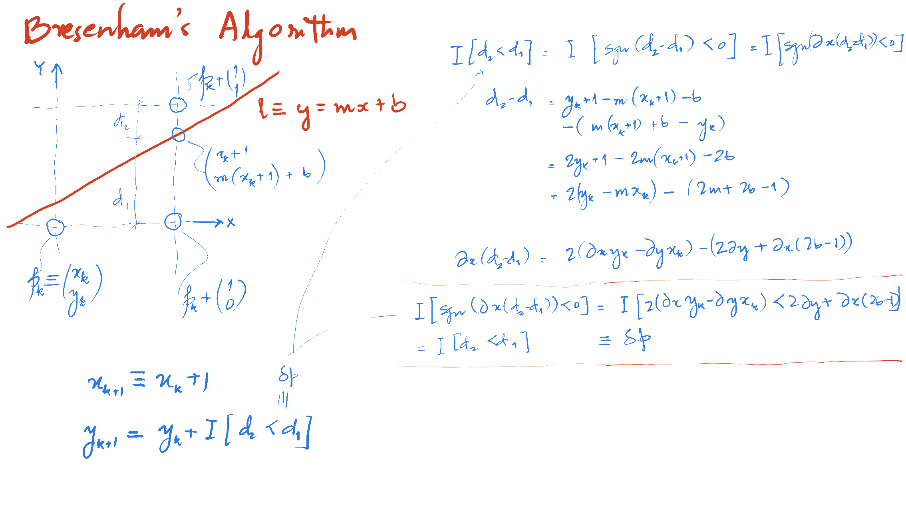

# 002 : Line Drawing #

## Usage ##

Either use [VSCode/Live-Server
Extension](https://github.com/tiet-ucs505/001-pixel#with-vscodelive-server-extension)
or use
[BrowerSync](https://github.com/tiet-ucs505/001-pixel#with-browsersync)

## Line Drawing ##

Given an image space $\Omega\subset\mathbb{Z}^2$ with
resolution $[W,H]^T$.  A point (or a pixel) is denoted
as $[x_a,y_a]^T\equiv\mathbf{a}\in\Omega$. 

Color value at pixel $\mathbf{a}$ is denoted as a point
in unit cube,
$\mathrm{color}\_{\nu}(\mathbf{a})\in\mathbb{R}^D_{[0,1]}$,
where $D$ represents channel depth. $D=1$ for a bitmap
or a grayscale image; $D=3$ for RGB; and $D=4$ for
RGBA. For all practical purposes, the color value is
resolved into an integer value with 8-bit depth and
discretised for ease of representation and storage, so
that
$\mathrm{color}(\mathbf{a})\in\mathbb{Z}^D_{[0,255]}$.

### Naïve ###


Given points $\mathbf{p},\mathbf{q}\in\Omega$ and line
resolution $N$, compute and plot on canvas, the set of
points $\mathbb{S}_p$ as follows:

$$\begin{align}
  \notag
  r(t) &= \left\lceil(1-t)\mathbf{p} + t\mathbf{q}
    \right\rceil
  \\
  %
  \mathbb{S}_p&\equiv
  \{\mathbf{x}_i=r(i/N):
    0\leqslant i\in\mathbb{Z}\leqslant N\}
\end{align}$$

where, $\lceil\mathbf{v}\rceil$ denotes ceiling
truncation for all components of vector $\mathbf{v}$.

### DDA Algo ###

#### Optimising for $N$ ####

We resolve the line into pixel counts into the larger
of the distance between the two endpoints resolved into
each of the axes; and compute the value of the
ordinates along the other axis.

So, $N = \max(|x_{p-q}|, |y_{p-q}|)$.

If $|y_{p-q}| < |x_{p-q}|$,

$$\begin{align}
\notag
y_i &= \left\lceil y_q + i\frac{y_{p-q}}{x_{p-q}} 
  \right\rceil
\\
%
\notag
x_i &= x_q + i\times\mathrm{sgn}(x_{p-q})
\end{align}$$

Otherwise,

$$\begin{align}
\notag
x_i &= \left\lceil x_q + i\frac{x_{p-q}}{y_{p-q}} 
  \right\rceil
\\
%
\notag
y_i &= y_q + i\times\mathrm{sgn}(y_{p-q})
\end{align}$$


And finally,

$$\begin{align}
\mathbb{S}_p &= \{
  [x_i,y_i]^T:0\leqslant i\in\mathbb{Z} \leqslant N
  \}
\end{align}$$


#### Optimising for arithmetic operations ####

Precomputing,

$$\begin{align}
    \notag
    m &= \frac{y_{p-q}}{x_{p-q}}
    \\
    %
    \notag
    m' &= \frac{x_{p-q}}{y_{p-q}}
    \\
    %
    \notag
    r(0) &= \mathbf{q}
\end{align}$$

We can rewrite the sequence as the following
recurrence,

$$\begin{align}
\mathrm{inc}(i) &= \begin{cases}
[\mathrm{sgn}(x_{p-q}), m]^T, &\text{if}\quad |y_{p-q}|
< |x_{p-q}|; \\
[m', \mathrm{sgn}(y_{p-q})]^T, &\text{otherwise.}
\end{cases}
\\
r(i) &= r(i-1) + \mathrm{inc}(i) \\
\mathbb{S}_p &= \{r(i):0\leqslant i\in\mathbb{Z}
\leqslant N\}
\end{align}$$


### Bresenham Algorithm ###

#### Case 1: $|m|\leqslant1$ ####



Let theoretical line between $\mathbf{p},\mathbf{q}$ be
given by $y=mx+b$; $|m|\leqslant1; x_p\leqslant
x_q$. Starting with $\mathbf{p}_0 = \mathbf{p}$, moving
towards $\mathbf{q}$, let $\mathbf{p}_k\equiv
[x_k,y_k]^T$ be the point closest to the line after
$k^{\text{th}}$ iteration.  The potential candidates,
consequently, for the $(k+1)^{\text{th}}$ iteration are
$\mathbf{r}_1=[x_k+1,y_k]^T$ and
$\mathbf{r}_2 = [x_k+1,
y_k+\mathrm{sgn}(y_{q-p})]^T$.

If $\mathbf{r} = [x_k+1, b +
m(x_k+1)]^T$, be the point on
theoretical curve, we'd choose the closer one.

$$\begin{align}
\notag
x_{k+1} &= x_k + 1
\\
%
\notag
y_{k+1} &= y_k+\begin{cases}
0, &\text{if}\quad\delta_{k+1}<0; \\
\mathrm{sgn}(y_{q-p}), &\text{otherwise.}
\end{cases}
\end{align}$$

The condition $\delta_{k+1}<0$ indicates that
$\\|\mathbf{r}_1-\mathbf{r}\\|<\\|\mathbf{r}-\mathbf{r}_2\\|$

```math
\begin{align}
\|\mathbf{r}_1-\mathbf{r}\|-\|\mathbf{r}-\mathbf{r}_2\|
&= \mathrm{sgn}(y_{q-p})(y_k-m(x_k+1)-b -m(x_k+1)-b+y_k+\mathrm{sgn}(y_{q-p}))
\\
&= \mathrm{sgn}(y_{q-p})(2y_k-2mx_k+\mathrm{sgn}(y_{q-p}) -2m-2b)
\\
x_{q-p}(\|\mathbf{r}_1-\mathbf{r}\| - \|\mathbf{r}-\mathbf{r}_2\|) 
&= \mathrm{sgn}(y_{q-p})(2y_kx_{q-p} -2x_ky_{q-p} - x_{q-p}(2b-\mathrm{sgn}(y_{q-p}))-2y_{q-p}) \\
&\equiv \delta_{k+1}
\end{align}
```


Hence, computing $\delta_{k+1}$ is a fully integer
operation.  And unfolding the signum, we can rewrite
the condition above as,

$$\begin{align}
\delta_{k+1} &= \begin{cases}
2y_kx_{q-p} - 2x_ky_{q-p} - x_{q-p}(2b-1) - 2y_{q-p},
&\text{if}\quad y_p\leqslant y_q;
\\
2x_ky_{q-p} - 2y_kx_{q-p} + x_{q-p}(2b+1) + 2y_{q-p},
&\text{otherwise.}
\end{cases}
\end{align}$$

#### Case 2: $1 < |m|$ ####

Similarly, for $x=m'y+b'$; $|m'|\lt1; y_p\leqslant y_q$
and starting at $\mathbf{p}_0=\mathbf{p}$ moving
towards $\mathbf{q}$, we have,

$$\begin{align}
\notag
y_{k+1} &= y_k+1
\\
%
\notag
x_{k+1} &= x_k+\begin{cases}
0, &\text{if}\quad\delta_{k+1}<0;
\\
\mathrm{sgn}(x_{q-p}), &\text{otherwise}.
\end{cases}
\\
%
\notag
\delta_{k+1} &= \begin{cases}
2x_ky_{q-p} - 2y_kx_{q-p} - y_{q-p}(2b'-1) - 2x_{q-p},
&\text{if}\quad x_p\leqslant x_q;
\\
2y_kx_{q-p} - 2x_ky_{q-p} + y_{q-p}(2b'+1) + 2x_{q-p},
&\text{otherwise.}
\end{cases}
\end{align}$$
